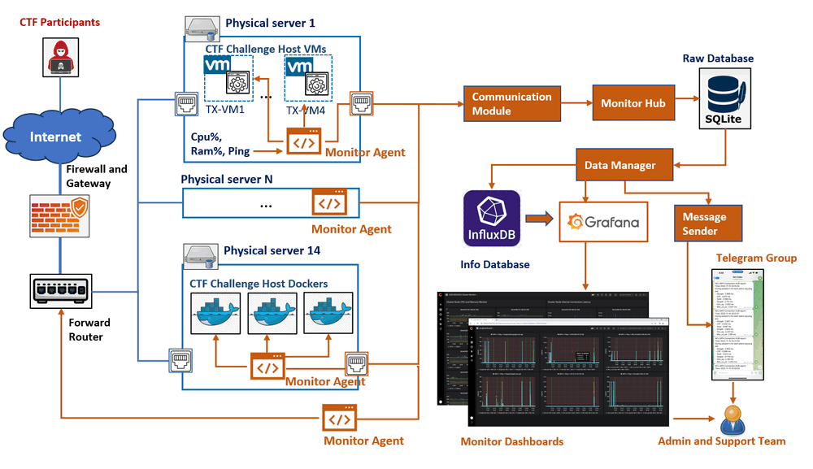
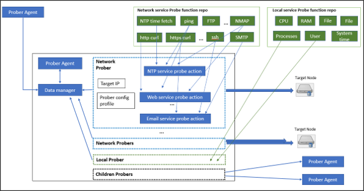
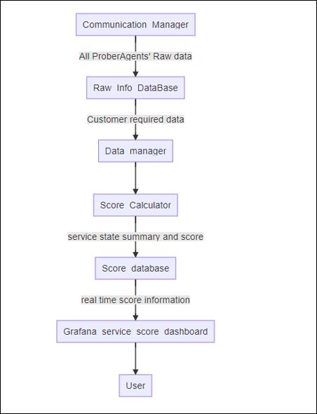
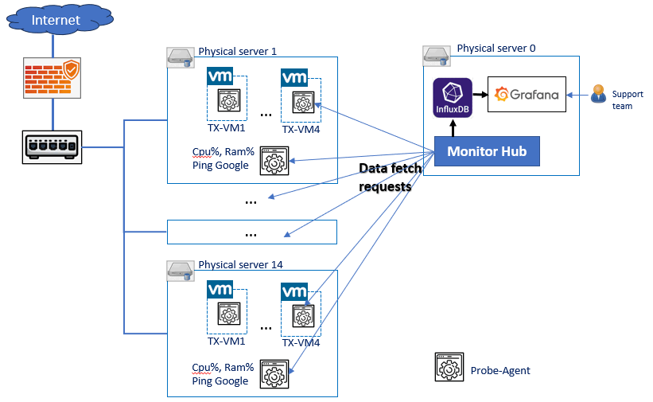
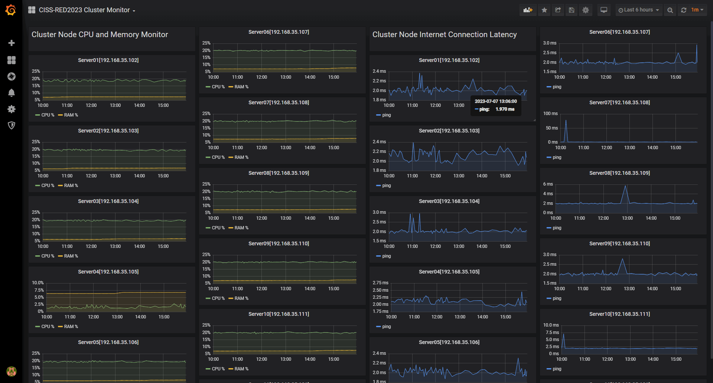

# **Building a Lightweight, Secure Cluster Monitor with InfluxDB and Grafana**

**Project Design Purpose** : This article walks through a lightweight, self-hosted server/VM cluster monitoring system built with Python, InfluxDB, and Grafana, designed specifically to handle the special or customized requirement for monitoring the  security labs, OT networks, or isolated clusters. Instead of relying on a black-box agent, you’ll build your own custom data collectors and monitor that fetch metrics from exactly the sources you need—whether that’s IPMI, network probes, or application-specific endpoints—and push them into a secure, local time-series database.

The practical example in this article is inspired by the CISS-Red_Cluster_Monitor project, which was developed to monitor a sandbox cluster (400+ VM) used for supporting a red team cybersecurity CTF competition. To make the design clear and reproducible, the article is structured around four main parts:

- **Core Idea** – The overall system architecture, including the agent/fetcher model and communication flow.
- **Security Design Choice** – How the system is designed to prevent participants from reverse-engineering agents or sending fake metrics.
- **Technology Stack** – The tools used (Python, InfluxDB, Grafana, etc.) and how to install and configure them.
- **Data and UI** – How data is stored, visualized in dashboards, and summarized or alerted (e.g., via Grafana and Telegram).

```python
# Author:      Yuancheng Liu
# Created:     2026/01/27
# Version:     v_0.2.1
# Copyright:   Copyright (c) 2025 Liu Yuancheng
# License:	   GNU General Public License
```

**Table of Contents**

[TOC]

------

### 1. Introduction

There are several tools in the market for supervising servers and VM clusters solutions like [PM2](https://pm2.keymetrics.io/) and similar platforms can monitor workload, network latency, and services running in Docker or virtual machines with very little setup. But some times we may have some special or customized requirement for monitoring the  security labs, OT networks, or isolated clusters, such as: 

- Can’t directly install agents on certain devices
- Need to collect power and hardware telemetry from sources like IPMI instead of OS-level agents
- The system must run in a fully local / air-gapped environment with no internet access
- Need to visualize the custom data collection and validation logic.

Based on these scenario and requirement, the monitoring system had to be: Simple and reliable under competition load, Secure against tampering or fake data injection, Deployable in a restricted network environment, and easy for administrators to visualize and audit in real time. 

#### 1.1 Usage Case Background And Objectives 

For example, the CISS-Red Stage One CTF event required continuous monitoring of multiple physical servers and virtual machines over a 48-hour period to ensure infrastructure stability and enable rapid incident response. The monitoring objective was to track key metrics in real time—including host servers CPU and memory usage, network latency, service availability of the CTF challenge VMs, and user SSH login activity—and to present all of this information through a centralized, intuitive dashboard. Whenever an abnormal condition was detected, the system would automatically send alert notifications to the support and administrator Telegram groups.


------

### 2. System Architecture

The monitoring system adopts a fetch-based agent architecture, where a central Monitor Hub actively pulls data from distributed agents instead of having agents push data upstream. This design choice is driven primarily by security considerations: in a CTF environment, participants may attempt to reverse-engineer agent code or forge requests to inject fake metrics. By keeping all data collection under the control of the central hub, the attack surface is significantly reduced and unauthorized data submission can be effectively prevented.

From an architectural perspective, the system follows a simple three-tier design as shown below:

```python
┌──────────────┐         ┌──────────────┐         ┌──────────────┐
│  Physical    │         │  Physical    │         │  Physical    │
│  Server 1    │         │  Server 2    │         │  Server N    │
│  ┌────────┐  │         │  ┌────────┐  │         │  ┌────────┐  │
│  │ Agent  │  │         │  │ Agent  │  │         │  │ Agent  │  │
│  │(Python)│  │         │  │(Python)│  │         │  │(Python)│  │
│  └────────┘  │         │  └────────┘  │         │  └────────┘  │
│      │ Local │         │      │ Local │         │      │ Local │
│      │Storage│         │      │Storage│         │      │Storage│
└──────┼───────┘         └──────┼───────┘         └──────┼───────┘
       └────────────────┬───────┴────────────────────────┘
                        │ HTTP Fetch Requests(Pull Mode)
                        ▼
              ┌──────────────────────────┐
              │  Monitor Hub (Collector) │
              └────────┬─────────────────┘
                       │ Write Metrics
                       ▼
              ┌──────────────────────────────────┐
              │   InfluxDB(Time-Series Database) │
              └────────┬─────────────────────────┘
                       │ Query Data
                       ▼
              ┌──────────────────────────────────────┐
              │    Grafana Dashboard (Visualization) │
              └──────────────────────────────────────┘
```

- **Agent Layer** – Lightweight Python agents deployed on, or connected to, monitored nodes to collect system and service metrics.

- **Storage Layer** – An InfluxDB time-series database used to efficiently store and query monitoring data.

- **Visualization Layer** – A Grafana dashboard that provides real-time visualization, historical analysis, and operational overview of the cluster and a message sender to send the 

#### 2.1 System Workflow Detail

The overall system workflow is illustrated in the diagram below.



In the CISS-Red CTF environment, the participants first SSH into a gateway through the firewall and then access their assigned challenge virtual machines. Each physical server hosting challenge VMs or Docker containers is equipped with two RJ45 network interfaces connected to two isolated networks:

- **Interface 1 (blue path in the diagram)** is used exclusively for participant traffic to access the challenge services.
- **Interface 2 (orange path in the diagram)** is dedicated to monitoring traffic, allowing the monitoring agents and hub to collect operational data without interfering with or being exposed to participant activity.

This configuration ensures that monitoring traffic does not affect the performance or fairness of the competition environment. From a functional point of view, the system consists of three main components:

- **Service Prober Repository** : A reusable service-checking library that provides multiple probing functions (e.g., NTP, FTP, VNC, SSH, and custom service checks). These probers are used to verify whether a specific node, service, program, or function in the cluster is operating correctly.
- **Prober Agent** : A lightweight agent responsible for scheduling and executing different probers to assess the availability and health of one or more targets in the cluster. The agent can run locally on a server to collect metrics directly. For nodes where an agent cannot be installed, the system falls back to **SSH-based command execution** to retrieve the required data remotely.
- **Monitor Hub** : The central monitoring and analysis component, which provides: a database backend (InfluxDB) for archiving time-series metrics, a web-based dashboard (Grafana) for real-time and historical visualization, and extensible interfaces for integrating custom logic, such as score calculation formulas or competition-specific evaluation functions.

#### 2.2 Technology Stack

The library and tools used in this project and the related link are shown in the below table : 

| Component              | Technology   | Version | Purpose                 | Link                                                         |
| ---------------------- | ------------ | ------- | ----------------------- | ------------------------------------------------------------ |
| Programming Language   | Python       | 3.7.4+  | Agent development       |                                                              |
| Time-Series Database   | InfluxDB     | 1.8.10  | Metric storage          | https://docs.influxdata.com/influxdb/v1/about_the_project/release-notes/ |
| Visualization Platform | Grafana      | Latest  | Dashboard creation      | https://grafana.com/                                         |
| System Monitoring      | psutil       | Latest  | CPU/RAM metrics         |                                                              |
| Network Testing        | pythonping   | Latest  | Latency measurement     |                                                              |
| Time Synchronization   | ntplib       | Latest  | Timestamp accuracy      |                                                              |
| Telegram API           | Telegram Bot | Latest  | Real time alert message | https://www.toptal.com/developers/python/telegram-bot-tutorial-python |


------

### 3. System Modules Design

In this section we will introduce the detail design of the 3 components 

#### 3.1 Service Prober Repository 

Service Prober Repository is a prober module lib to provide the service / program function check function. The prober function can be categorized to three parts: local service probers, children agent prober and network service probers.

**Local service prober :** The local service prober will run inside the target node to monitor the nodes resource usage (CPU%, Memory, Hard disk, user), network state (port opened, connection, NIC I/O state), local program execution state (process) and file system modification. The probers details are shown below: 

| **Prober Name**       | **Probe action/ service covered**                            |
| --------------------- | ------------------------------------------------------------ |
| Resource usage Prober | CPU %, Memory %, Hard Disk %, Network  Bandwidth Usage.      |
| User action Prober    | User login, cmd  executed, file system modification.         |
| Program action prober | Program execution, process started,  service port opened, program log check. |

**Children Agent prober :** A prober to fetch data from other prober agent program and merge the data. This prober is used for link the subnets which only linked with jump host without set routing table. 

**Network Service prober:** The service prober run outside the target nodes to check the node's services state through network. The probe functions provided are shown below: 

| **Prober Name**              | **Probe action/ service covered**                            |
| ---------------------------- | ------------------------------------------------------------ |
| Server active Prober         | ICMP (ping), SSH(login), RDP, VNC,  X11/X11:1-Win            |
| Service ports prober         | Use a customized Nmap lib check whether  the node's request service ports are opened. |
| **NTP** service prober       | Check the NTP  service latency and time offset correctness.  |
| **DNS/NS**  service prober   | Check the dns service name mapping correct.                  |
| **DHCP** service prober      | Check the dhcp broadcast.                                    |
| **FTP** service prober       | Whether can  login the FTP server and list the directory tree. |
| **Http/https web** prober    | Check the webserver can handle request correctly             |
| **Email**  service prober    | Check whether the email server is working normally           |
| **TCP/UDP**  service prober  | Service use  TCP/UDP connection. (such as MS-Teams, Skype service) |
| **Database**  service prober | Check the database connection                                |

#### 3.2 Prober Agent Module

An agent program collects and schedules several different kinds of probers based on the customized config profile to check the entire service availably of a small cluster as shown in the below diagram



The prober agent provides below 5 main features: 

- **Configuration base on profile** : User can easily use their customized profile to config all probers’ execution timeline.
- **Probing from outside/Inside** : Agent can run inside the critical node to check the node's local state or run outside in a node to check the service interface of multiple nodes. So, the customer can deploy the agents based on his monitor priority instead of deploying agent to every node. 
- **Customized prober plugin** : It also provides the interface for customer to plugin their customized probe function for specific service (such as a check a billing server).
- **Data report bus**: To avoid changing the original routing config of a cluster, a prober agent can also fetch data from the other touchable prober agents to build a data translation bus/chain to make the deployment easier.
- **Multiple connection protocol** : The agent provide different network protocol for data fetch/report (TCP, UDP, HTTP, HTTPS) to fit for the network traffic limitation requirement in a cyber exercise. 

#### 3.3 Monitor Hub Module

The monitor hub is a data processing, analysis and visualization system. All the prober agents will report their monitor result to the monitor hub via communication manager. The monitor hub provides a web-based dashboard (currently we are using Grafana) for users to check the monitored cluster's state, a topology diagram to show the clusters’ services online state and it also provides the interface for user to plug in their score calculation formular/function. The data flow diagram is shown on the right side. 

Two data bases will be included in the program: 



- **Raw info database:** A database used to archive all the collected service data. 

- **Score database**: A database save all the data need to be visualized in the score database. 

The data manager will fetch needed data from Raw-Info-DB, process and analysis the raw data and calculate the service core based on customer's score calculation function, then insert/update the data in score database.




##### Dashboard UI

The main dashboard contents 22 small chart under 4 column, the column 1 and 2 will show the physical servers' CPU and Ram usage %, the column 3 and 4 will show the network latency.




config cmd:

```
mkdir monitorAgent
sudo timedatectl set-timezone Asia/Singapore
sudo vim /etc/resolv.conf
sudo apt install python3-pip
sudo pip3 install influxdb
sudo pip3 install pythonping
sudo pip3 install ntplib
sudo pip3 install psutil
git clone https://github.com/LiuYuancheng/CISSRed_Cluster_Monitor.git

sudo nohup python3 monitorAgent/CISSRed_Cluster_Monitor/src/client/AgentRun.py &

sudo nohup python3 AgentRun.py &

record the process:

sudo nohup python3 AgentRun.py &

ncl@cptest4:~$ sudo nohup python3 monitorAgent/CISSRed_Cluster_Monitor/src/client/AgentRun.py &
[1] 137511

163414

ps ax | grep AgetntRun.py

sudo systemctl start influxdb
```


```
Connected to http://localhost:8086 version 1.8.10
InfluxDB shell version: 1.8.10
> SHOW MEASUREMENTS ON monitorDB
> SHOW MEASUREMENTS ON gatewayDB
> USE monitorDB
Using database monitorDB
> SHOW MEASUREMENTS
> INSERT cpu,host=serverA value=10
> SHOW MEASUREMENTS
name: measurements
name
----
cpu
> exit
```

