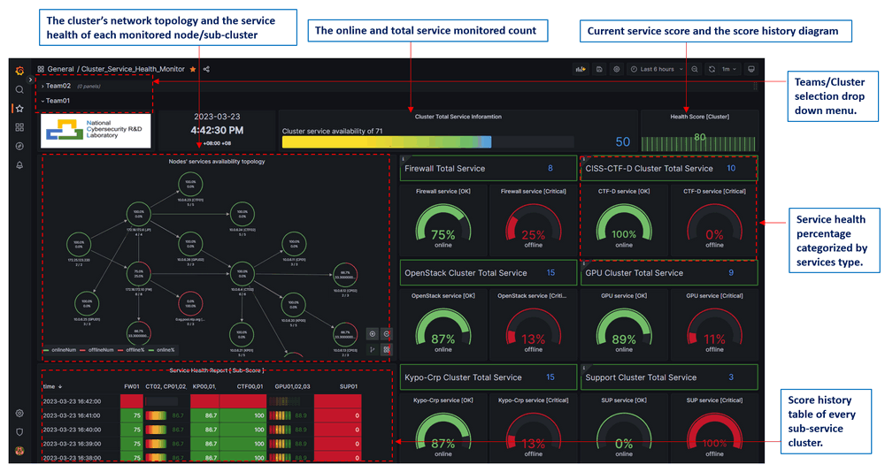
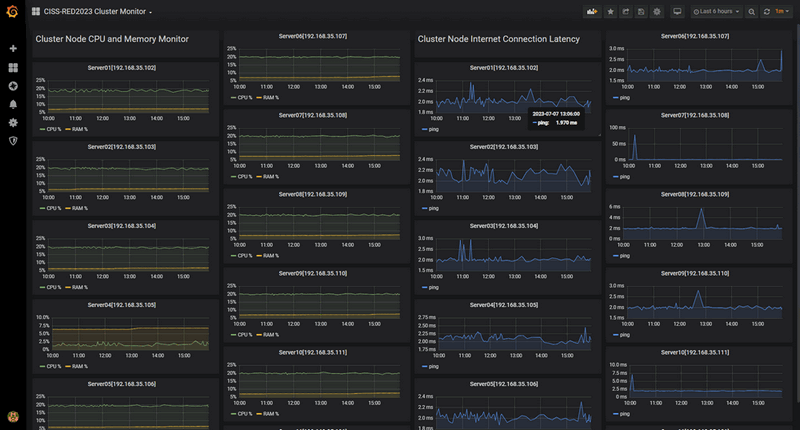
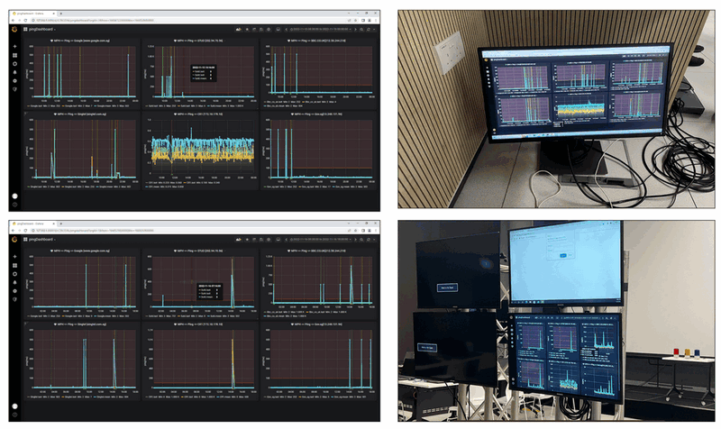
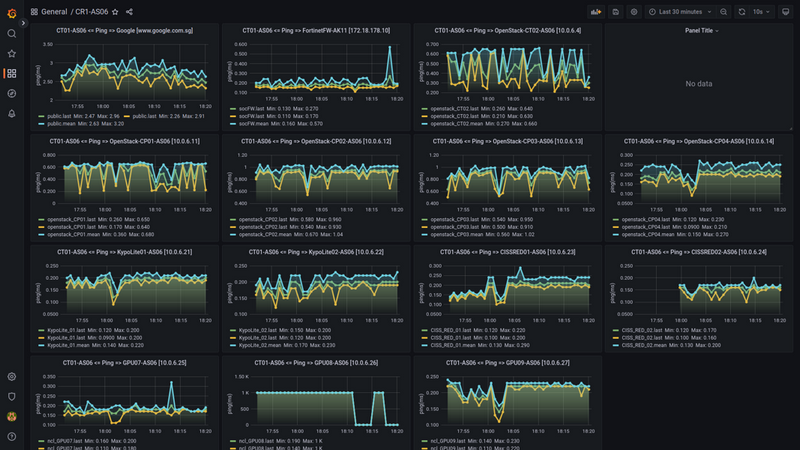
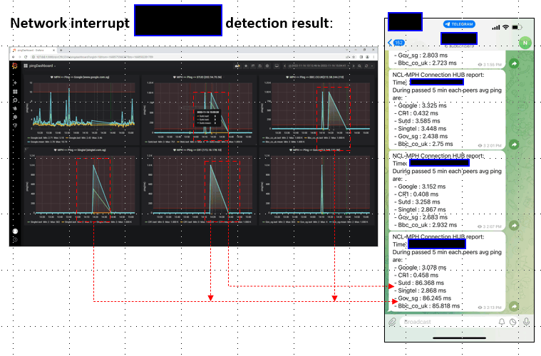

# **Building a Lightweight, Secure Cluster Monitor with InfluxDB and Grafana**

**Project Design Purpose** : This article walks through a lightweight, self-hosted server/VM cluster monitoring system built with Python, InfluxDB, and Grafana, designed specifically to handle the special or customized requirement for monitoring the  security labs, OT networks, or isolated clusters. Instead of relying on a black-box agent, you’ll build your own custom data collectors and monitor that fetch metrics from exactly the sources you need—whether that’s IPMI, network probes, or application-specific endpoints—and push them into a secure, local time-series database.

The practical example in this article is inspired by the CISS-Red_Cluster_Monitor project, which was developed to monitor a sandbox cluster (400+ VM) used for supporting a red team cybersecurity CTF competition. To make the design clear and reproducible, the article is structured around four main parts:

- **Core Idea** – The overall system architecture, including the agent/fetcher model and communication flow.
- **Security Design Choice** – How the system is designed to prevent participants from reverse-engineering agents or sending fake metrics.
- **Technology Stack** – The tools used (Python, InfluxDB, Grafana, etc.) and how to install and configure them.
- **Data and UI** – How data is stored, visualized in dashboards, and summarized or alerted (e.g., via Grafana and Telegram).

```python
# Author:      Yuancheng Liu
# Created:     2026/01/27
# Version:     v_0.2.1
# Copyright:   Copyright (c) 2025 Liu Yuancheng
# License:	   GNU General Public License
```

**Table of Contents**

[TOC]

------

### 1. Introduction

There are several tools in the market for supervising servers and VM clusters solutions like [PM2](https://pm2.keymetrics.io/) and similar platforms can monitor workload, network latency, and services running in Docker or virtual machines with very little setup. But some times we may have some special or customized requirement for monitoring the  security labs, OT networks, or isolated clusters, such as: 

- Can’t directly install agents on certain devices
- Need to collect power and hardware telemetry from sources like IPMI instead of OS-level agents
- The system must run in a fully local / air-gapped environment with no internet access
- Need to visualize the custom data collection and validation logic.

Based on these scenario and requirement, the monitoring system had to be: Simple and reliable under competition load, Secure against tampering or fake data injection, Deployable in a restricted network environment, and easy for administrators to visualize and audit in real time. 

#### 1.1 Usage Case Background And Objectives 

For example, the CISS-Red Stage One CTF event required continuous monitoring of multiple physical servers and virtual machines over a 48-hour period to ensure infrastructure stability and enable rapid incident response. The monitoring objective was to track key metrics in real time—including host servers CPU and memory usage, network latency, service availability of the CTF challenge VMs, and user SSH login activity—and to present all of this information through a centralized, intuitive dashboard. Whenever an abnormal condition was detected, the system would automatically send alert notifications to the support and administrator Telegram groups.


------

### 2. System Architecture

The monitoring system adopts a fetch-based agent architecture, where a central Monitor Hub actively pulls data from distributed agents instead of having agents push data upstream. This design choice is driven primarily by security considerations: in a CTF environment, participants may attempt to reverse-engineer agent code or forge requests to inject fake metrics. By keeping all data collection under the control of the central hub, the attack surface is significantly reduced and unauthorized data submission can be effectively prevented.

From an architectural perspective, the system follows a simple three-tier design as shown below:

```python
┌──────────────┐         ┌──────────────┐         ┌──────────────┐
│  Physical    │         │  Physical    │         │  Physical    │
│  Server 1    │         │  Server 2    │         │  Server N    │
│  ┌────────┐  │         │  ┌────────┐  │         │  ┌────────┐  │
│  │ Agent  │  │         │  │ Agent  │  │         │  │ Agent  │  │
│  │(Python)│  │         │  │(Python)│  │         │  │(Python)│  │
│  └────────┘  │         │  └────────┘  │         │  └────────┘  │
│      │ Local │         │      │ Local │         │      │ Local │
│      │Storage│         │      │Storage│         │      │Storage│
└──────┼───────┘         └──────┼───────┘         └──────┼───────┘
       └────────────────┬───────┴────────────────────────┘
                        │ HTTP Fetch Requests(Pull Mode)
                        ▼
              ┌──────────────────────────┐
              │  Monitor Hub (Collector) │
              └────────┬─────────────────┘
                       │ Write Metrics
                       ▼
              ┌──────────────────────────────────┐
              │   InfluxDB(Time-Series Database) │
              └────────┬─────────────────────────┘
                       │ Query Data
                       ▼
              ┌──────────────────────────────────────┐
              │    Grafana Dashboard (Visualization) │
              └──────────────────────────────────────┘
```

- **Agent Layer** – Lightweight Python agents deployed on, or connected to, monitored nodes to collect system and service metrics.

- **Storage Layer** – An InfluxDB time-series database used to efficiently store and query monitoring data.

- **Visualization Layer** – A Grafana dashboard that provides real-time visualization, historical analysis, and operational overview of the cluster and a message sender to send the 

#### 2.1 System Workflow Detail

The overall system workflow is illustrated in the diagram below.


In the CISS-Red CTF environment, the participants first SSH into a gateway through the firewall and then access their assigned challenge virtual machines. Each physical server hosting challenge VMs or Docker containers is equipped with two RJ45 network interfaces connected to two isolated networks:

- **Interface 1 (blue path in the diagram)** is used exclusively for participant traffic to access the challenge services.
- **Interface 2 (orange path in the diagram)** is dedicated to monitoring traffic, allowing the monitoring agents and hub to collect operational data without interfering with or being exposed to participant activity.

This configuration ensures that monitoring traffic does not affect the performance or fairness of the competition environment. From a functional point of view, the system consists of three main components:

- **Service Prober Repository** : A reusable service-checking library that provides multiple probing functions (e.g., NTP, FTP, VNC, SSH, and custom service checks). These probers are used to verify whether a specific node, service, program, or function in the cluster is operating correctly.
- **Prober Agent** : A lightweight agent responsible for scheduling and executing different probers to assess the availability and health of one or more targets in the cluster. The agent can run locally on a server to collect metrics directly. For nodes where an agent cannot be installed, the system falls back to **SSH-based command execution** to retrieve the required data remotely.
- **Monitor Hub** : The central monitoring and analysis component, which provides: a database backend (InfluxDB) for archiving time-series metrics, a web-based dashboard (Grafana) for real-time and historical visualization, and extensible interfaces for integrating custom logic, such as score calculation formulas or competition-specific evaluation functions.

#### 2.2 Technology Stack

The library and tools used in this project and the related link are shown in the below table : 

| Component              | Technology   | Version | Purpose                 | Link                                                         |
| ---------------------- | ------------ | ------- | ----------------------- | ------------------------------------------------------------ |
| Programming Language   | Python       | 3.7.4+  | Agent development       |                                                              |
| Time-Series Database   | InfluxDB     | 1.8.10  | Metric storage          | https://docs.influxdata.com/influxdb/v1/about_the_project/release-notes/ |
| Visualization Platform | Grafana      | Latest  | Dashboard creation      | https://grafana.com/                                         |
| System Monitoring      | psutil       | Latest  | CPU/RAM metrics         |                                                              |
| Network Testing        | pythonping   | Latest  | Latency measurement     |                                                              |
| Time Synchronization   | ntplib       | Latest  | Timestamp accuracy      |                                                              |
| Telegram API           | Telegram Bot | Latest  | Real time alert message | https://www.toptal.com/developers/python/telegram-bot-tutorial-python |


------

### 3. System Modules Design

This section describes the detailed design of the three core components of the monitoring system: the Service Prober Repository, the Prober Agent, and the Monitor Hub. 

#### 3.1 Service Prober Repository Design 

The **Service Prober Repository** is a reusable python probing library that provides a wide range of functions to check the status of services, programs, and system resources then plug in to the prober agent. All probe functions are designed as modular components and can be grouped into three categories: **local service probers**, **child agent probers**, and **network service probers**.

**3.1.1 Local Service Probers**

Local service probers run directly on the target node and focus on monitoring the node’s internal state, including:

- System resource usage (CPU, memory, disk, network I/O),
- User activities (login sessions, command execution, file system changes),
- Local program and process states (process lifecycle, service ports, log status).

The main local probers are summarized below:

| **Prober Name**       | **Probe Action / Coverage**                                  |
| --------------------- | ------------------------------------------------------------ |
| Resource Usage Prober | CPU %, memory %, disk usage %, network bandwidth usage       |
| User Action Prober    | User login, command execution, file system modification      |
| Program Action Prober | Process execution, service startup, port status, log checking |

**3.1.2 Child Agent Prober**

The Child Agent Prober is used to fetch and aggregate data from other prober agents and merge the results into a unified view. This mechanism is especially useful in segmented network environments where certain subnets are only reachable through a jump host and no direct routing is available. By chaining agents together, the system can bridge isolated network segments without changing the existing routing configuration.

**3.1.3 Network Service Probers**

Network service probers run outside the target nodes and verify service availability and correctness over the network. These probers simulate real client behavior and check whether services are reachable, responsive, and functioning as expected.

| **Prober Name**         | **Probe Action / Coverage**                                  |
| ----------------------- | ------------------------------------------------------------ |
| Server Active Prober    | ICMP (ping), SSH login, RDP, VNC, X11/X11:1-Win              |
| Service Ports Prober    | Customized Nmap-based port scanning for required services    |
| NTP Service Prober      | NTP latency and time offset correctness                      |
| DNS/NS Service Prober   | DNS name resolution correctness                              |
| DHCP Service Prober     | DHCP broadcast and response check                            |
| FTP Service Prober      | FTP login and directory listing                              |
| HTTP/HTTPS Web Prober   | Web service request/response correctness                     |
| Email Service Prober    | Basic email service availability check                       |
| TCP/UDP Service Prober  | Generic TCP/UDP service connectivity (e.g., Teams, Skype-like services) |
| Database Service Prober | Database connectivity and basic query checks                 |

These probers together provide comprehensive coverage of both infrastructure health and application-level service availability.

#### 3.2 Prober Agent Module Design

The Prober Agent is responsible for collecting, scheduling, and executing different probers based on a customized configuration profile. Each agent can monitor a single node or multiple targets, depending on deployment needs. The overall workflow is illustrated in the diagram below.


The prober agent provides the following five key features:

- **Profile-Based Configuration** : Users can define customized profiles to control which probers run, their execution intervals, and their target scope, making the monitoring behavior easy to adapt to different environments.
- **Inside/Outside Probing** : The agent can run inside critical nodes to inspect local system state, or outside to probe the service interfaces of multiple nodes. This allows flexible deployment without requiring an agent on every single node.
- **Custom Prober Plugins** : The system provides extension interfaces for users to plug in their own custom probers for application-specific checks (e.g., verifying the status of a billing service or competition scoring service).
- **Data Relay Bus** : To avoid changing the original network routing of a cluster, a prober agent can also fetch data from other reachable agents and act as a relay, forming a data collection chain across segmented networks.
- **Multiple Communication Protocols** : The agent supports multiple data fetch and reporting protocols (TCP, UDP, HTTP, HTTPS) to adapt to different network security policies and traffic restrictions commonly found in cyber exercise environments.

#### 3.3 Monitor Hub Module Design

The Monitor Hub is the central component responsible for data ingestion, processing, analysis, and visualization. All prober agents report their monitoring results to the hub through a communication manager. The hub then stores, processes, and presents the data to administrators through a web-based interface (currently using Grafana).

In addition to real-time dashboards, the Monitor Hub also provides:

- A topology view showing the online/offline state of cluster services,

- And an extension interface for integrating custom scoring or evaluation functions, which is particularly useful in CTF or cyber exercise scenarios.

The data flow architecture is illustrated below : 


Two databases are used in the system:

- **Raw Info Database** : Stores all collected raw monitoring data from the prober agents for auditing, analysis, and historical reference.
- **Score Database** : Stores processed and aggregated data that is directly used for visualization and scoring display.

The **Data Manager** component retrieves data from the Raw Info Database, performs processing and analysis, applies user-defined scoring functions, and then inserts or updates the results in the Score Database. This separation ensures that raw data is preserved while keeping the visualization layer fast and focused on meaningful, high-level metrics.


### 4. Grafana Dashboard UI and Telegram Config

In the Grafana, we setup different charts to show the historian information and the chart is setting in the different dashboard. 

**4.1 Cluster main sate view dashboard**

Below diagram is the main page to show the overview of the whole cluster 



The main page includes: 

- The cluster’s network topology and the service health of each monitored physical server machine  or sub-cluster 
- The online and total challenge program services monitored count
- The current challenge docker, pods and container healthy score and the score history diagram
- Current Challenge visual machine Service health percentage categorized by services type.  

**4.2 Physical Server Cluster Monitor Dashboard**

For each physical server, click the" physical cluster monitor" link contents 22 small chart under 4 column, the column 1 and 2 will show the physical servers' CPU and Ram usage %, the column 3 and 4 will show the network latency as shown below:



**4.3 Cluster Network Device and connection Dashboard** 

For each network node, click the" network nodes monitor dashboard" link,  it will show the outgress network connection,  the firewall and forward router network flow state as shown below diagram:



**4.4 CTF Challenge VM, docker service dashboard**

The challenge host VM and docker state dashboard is shown below:



4.5 Telegram remainder chat  

If there is any network latency more than the configured theshold, the system will send a remained alert chart to show the detail alert to the competition technical support team challenge.




------


config cmd:

```
mkdir monitorAgent
sudo timedatectl set-timezone Asia/Singapore
sudo vim /etc/resolv.conf
sudo apt install python3-pip
sudo pip3 install influxdb
sudo pip3 install pythonping
sudo pip3 install ntplib
sudo pip3 install psutil
git clone https://github.com/LiuYuancheng/CISSRed_Cluster_Monitor.git

sudo nohup python3 monitorAgent/CISSRed_Cluster_Monitor/src/client/AgentRun.py &

sudo nohup python3 AgentRun.py &

record the process:

sudo nohup python3 AgentRun.py &

ncl@cptest4:~$ sudo nohup python3 monitorAgent/CISSRed_Cluster_Monitor/src/client/AgentRun.py &
[1] 137511

163414

ps ax | grep AgetntRun.py

sudo systemctl start influxdb
```


```
Connected to http://localhost:8086 version 1.8.10
InfluxDB shell version: 1.8.10
> SHOW MEASUREMENTS ON monitorDB
> SHOW MEASUREMENTS ON gatewayDB
> USE monitorDB
Using database monitorDB
> SHOW MEASUREMENTS
> INSERT cpu,host=serverA value=10
> SHOW MEASUREMENTS
name: measurements
name
----
cpu
> exit
```

